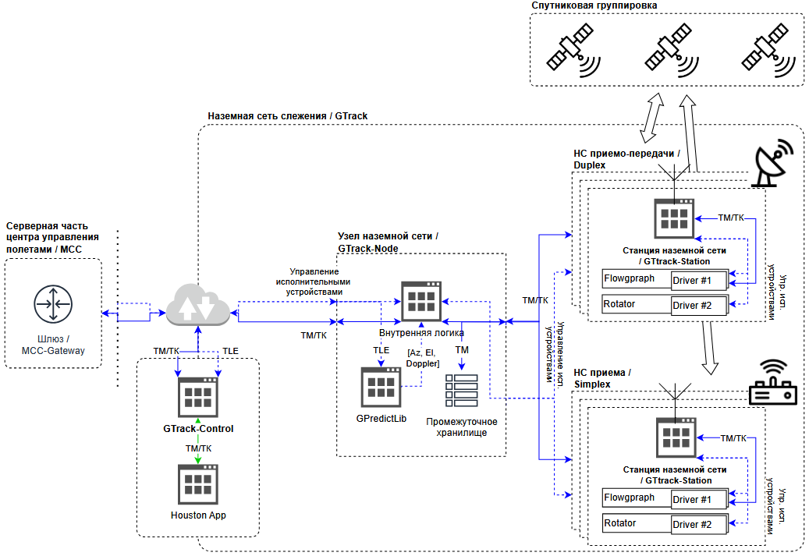

# GTrack (Наземная сеть слежения)

Распределенная сеть наземных станций для спутниковой связи и управления, состоящая из узлов слежения (`GTrack-Node`), наземных станций (`GTrack-Station`) и интерфейсов центра управления полетами (`MCC-Gateway`, `GTrack-Control`).

## 🌐 Архитектурный обзор

GTrack - это иерархическая сеть, предназначенная для надежной спутниковой связи (телеметрия и телекоманды) и автоматического управления антеннами.

### Структурная схема

## 🧩 Компоненты системы

### 1. MCC Gateway
Серверный компонент для автоматического управления полетами. Подключается к нескольким экземплярам `GTrack-Node`.

### 2. GTrack Control
Десктопное приложение для ручного управления при недоступности автоматизированного сервера.

### 3. GTrack Node
Программный компонент, развертываемый в каждом географически отделенном пункте управления. Выступает шлюзом между Центром управления и физическими станциями.

**Основные функции:**
- Аутентификация входящих подключений от `GTrack-Station` и `MCC-Gateway/GTrack-Control`
- Управление сессиями и отслеживание состояния подключений
- Маршрутизация данных между Центром управления и Станциями
- Обработка TLE с использованием библиотеки Gpredict для расчетов азимута/угла места/Допплера
- Временное хранение телеметрии с настраиваемыми лимитами

### 4. GTrack Station
Программное обеспечение для управления физическим оборудованием станции (антенны, радиомодули). Подключается к одному `GTrack-Node`.

**Основные функции:**
- Управление подключением к аппаратному обеспечению (GNU Radio Flowgraphs, ротаторы)
- Выполнение управляющих команд (Az/El/Doppler, параметры модуляции)
- Обработка данных телеметрии и телекоманд
- Управление конфигурацией подключенного оборудования

## 📡 Типы данных и протоколы

### Протоколы связи
- **Межкомпонентная связь**: gRPC (основной), TCP-сокеты
- **Связь с оборудованием**: Специфичные для устройств протоколы

### Типы данных
- **Телекоманды (Uplink)**: Команды на космический аппарат
- **Телеметрия (Downlink)**: Данные от космического аппарата
- **Команды управления**:
  - Данные TLE (MCC → Node)
  - Значения азимута/угла места/Допплера (Node → Station)
  - Параметры модуляции (MCC → Station)
  - Команды управления оборудованием
